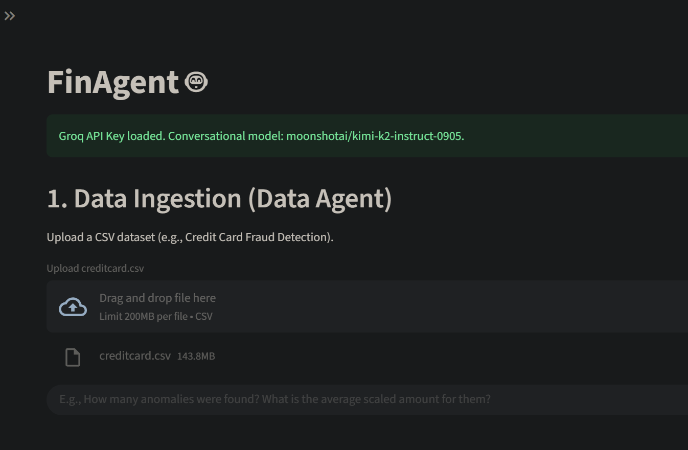
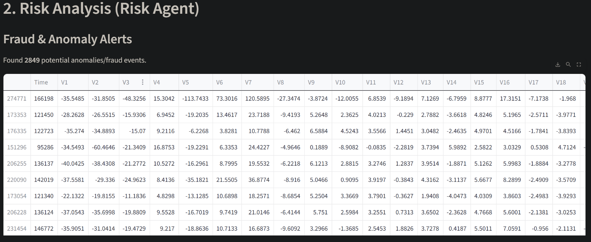
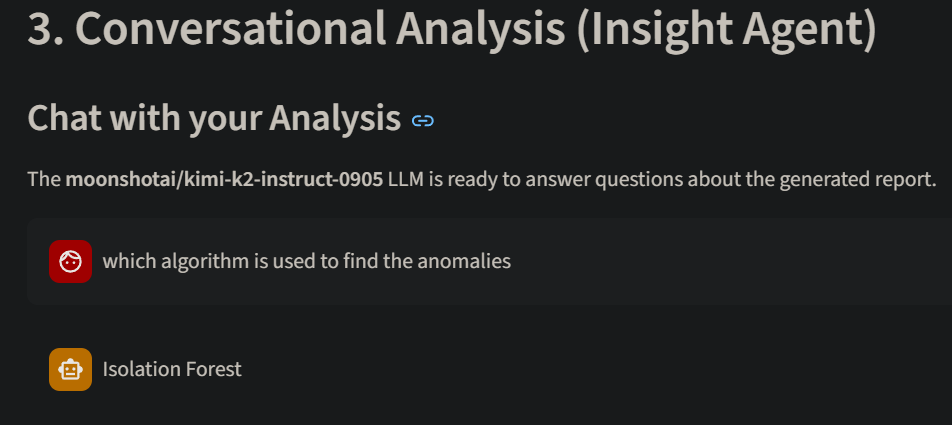

# FinAgent: Multi-Agent Financial Insight Engine

FinAgent is a powerful multi-agent system designed to provide comprehensive financial insights and risk assessments from transaction data. It uses specialized AI agents for data processing, insight generation, and fraud detection, all exposed through a robust FastAPI backend and an interactive Streamlit frontend.

## Project Structure

```
. \
├── app.py
├── config.py
├── orchestrator.py
├── req.txt
├── agents/
│   ├── data_agent.py
│   ├── insight_agent.py
│   └── risk_agent.py
├── api/
│   └── main.py
├── tests/
│   ├── __init__.py
│   ├── test_data_agent.py
│   ├── test_risk_agent.py
│   ├── test_orchestrator.py
│   └── test_api.py
├── chroma_db/ (runtime generated)
├── data/
└── models/
```

## Features

*   **Data Ingestion:** Upload transaction data in CSV or JSON format.
*   **Multi-Agent Analysis:** Orchestrates specialized agents for a holistic financial review.
    *   **Data Agent:** Processes raw data, generates statistics, and detects anomalies.
    *   **Insight Agent:** Answers natural language queries about financial data using LLMs and RAG.
    *   **Risk Agent:** Performs fraud detection and risk assessment using machine learning models.
*   **Interactive Dashboard:** Streamlit frontend for easy interaction and visualization.
*   **RESTful API:** FastAPI backend for programmatic access to FinAgent capabilities.
*   **Comprehensive Testing:** Full test suite with unit and integration tests for all components.

## How It Works

FinAgent uses a multi-agent architecture orchestrated by LangGraph to process financial transaction data through a series of specialized agents:

1. **Data Processing Agent**: Cleans and preprocesses raw transaction data, handles missing values, removes duplicates, and extracts relevant features.
2. **Risk Assessment Agent**: Trains machine learning models to detect fraudulent transactions and assess risk levels using supervised (when labels available) or unsupervised learning approaches.
3. **RAG Ingestion**: Converts processed data into documents and ingests them into a vector database for retrieval-augmented generation.
4. **Insight Generation Agent**: Uses large language models to analyze transaction patterns, answer natural language queries, and generate actionable insights.
5. **Summarization**: Creates a comprehensive summary of findings including risk assessments, anomalies detected, and key insights.

The workflow ensures that data flows seamlessly from ingestion to insight generation, with each agent building upon the work of the previous one.








## Setup and Installation

To get the FinAgent project up and running, follow these steps:

1.  **Clone the Repository (if you haven't already):**

    ```bash
    git clone https://github.com/wtfashwin/FinAgent-Multi-Agent-Financial-Insight-Engine.git
    cd FinAgent-Multi-Agent-Financial-Insight-Engine
    ```

2.  **Create a Virtual Environment (Recommended):**

    ```bash
    python -m venv venv
    ```

3.  **Activate the Virtual Environment:**

    *   **Windows:**
        ```bash
        .\venv\Scripts\activate
        ```
    *   **macOS/Linux:**
        ```bash
        source venv/bin/activate
        ```

4.  **Install Dependencies:**

    Install all the necessary Python packages using the provided `req.txt` file:

    ```bash
    pip install -r req.txt
    ```

5.  **Install Additional Required Dependencies:**

    ```bash
    pip install langchain-google-genai tf-keras
    ```

6.  **Configure API Keys (Optional but Recommended):**

    Create a `.env` file in the root directory and add your API keys for enhanced LLM capabilities:
    ```bash
    GROQ_API_KEY=your_groq_api_key_here
    GOOGLE_API_KEY=your_google_api_key_here
    ```

7.  **Set Environment Variables (Recommended):**

    To prevent TensorFlow warnings and potential initialization hangs:
    ```bash
    set TF_ENABLE_ONEDNN_OPTS=0
    ```

## Running the Application

FinAgent consists of two main components: a FastAPI backend and a Streamlit frontend. Both need to be running to use the full application.

### 1. Start the FastAPI Backend

Open your first terminal, navigate to the `api` directory, and run the `main.py` file:

```bash
cd api
python main.py
```

You should see output similar to this, indicating the FastAPI server is running (typically on `http://127.0.0.1:8000`):

```
INFO:     Uvicorn running on http://127.0.0.1:8000 (Press CTRL+C to quit)
INFO:     Started reloader process [PID] using StatReload
INFO:     Started server process [PID]
INFO:     Waiting for application startup.
INFO:     🚀 Starting FinAgent API...
INFO:     ✓ FinAgent initialized successfully
INFO:     Application startup complete.
```

### 2. Start the Streamlit Frontend

Open a **new terminal** (keep the FastAPI backend running in the first terminal). Navigate back to the root directory of your project (`FinAgent`) and run the Streamlit application:

```bash
streamlit run app.py
```

This will open the Streamlit application in your default web browser, usually at `http://localhost:8501`.

## Usage

Once both the backend and frontend are running:

1.  **Home Page:** Check the API health and get an overview of the project.
2.  **Upload Data:** Navigate to the "Upload Data" section to upload your transaction data (CSV or JSON).
3.  **Run Analysis:** Initiate a comprehensive multi-agent analysis on the uploaded data.
4.  **Get Insights:** Ask natural language queries to get specific financial insights.
5.  **Risk Summary:** View a summary of the risk assessment.
6.  **Statistics:** Get detailed statistics about your dataset.
7.  **Anomalies:** See any detected anomalies in your data.
8.  **Sample Data:** View a sample of the currently loaded data.

## API Endpoints

The FastAPI backend provides the following endpoints:

*   `GET /` - Root endpoint with API information
*   `GET /health` - Health check endpoint
*   `POST /api/upload` - Upload transaction data files
*   `POST /api/analyze` - Run complete multi-agent analysis
*   `POST /api/insights` - Generate insights based on natural language queries
*   `GET /api/risk/summary` - Get risk assessment summary
*   `GET /api/statistics` - Get dataset statistics
*   `GET /api/anomalies` - Get detected anomalies

## Testing

FinAgent includes a comprehensive test suite to ensure reliability and maintainability:

```bash
# Run all tests
python -m pytest tests/

# Run specific test file
python -m pytest tests/test_data_agent.py

# Run specific test
python -m pytest tests/test_data_agent.py::TestDataAgent::test_load_data

# Run tests with coverage
python -m pytest tests/ --cov=agents --cov=orchestrator --cov=api --cov-report=html
```

## Potential Enhancements

To make FinAgent more robust and feature-rich, consider implementing the following enhancements:

### 1. Enhanced Data Processing
*   Add support for more data formats (Excel, Parquet, etc.)
*   Implement advanced data validation and schema checking
*   Add data visualization capabilities for exploratory data analysis
*   Include time-series analysis for temporal pattern detection
*   Implement data quality scoring and automatic cleaning suggestions

### 2. Improved Risk Assessment
*   Implement ensemble methods combining multiple ML models
*   Add real-time risk scoring for streaming transactions
*   Include explainable AI features to understand risk factors
*   Add support for custom risk models and thresholds
*   Implement dynamic model updating based on new data
*   Add support for different types of financial fraud patterns

### 3. Advanced Insight Generation
*   Integrate multiple LLM providers for redundancy and comparison
*   Add support for multi-modal inputs (charts, graphs with LLMs)
*   Implement continuous learning from user feedback
*   Add industry-specific insight templates
*   Include automated report generation capabilities
*   Implement sentiment analysis for financial news integration

### 4. Scalability and Performance
*   Implement database storage for persistent data management
*   Add caching mechanisms for frequently accessed insights
*   Implement asynchronous processing for large datasets
*   Add support for distributed computing with Dask or Ray
*   Implement microservices architecture for better scalability
*   Add load balancing and horizontal scaling capabilities

### 5. Security and Compliance
*   Add data encryption for sensitive financial information
*   Implement role-based access control (RBAC)
*   Add audit logging for compliance requirements
*   Include GDPR/CCPA compliance features
*   Implement secure API authentication and authorization
*   Add data anonymization features for privacy protection

### 6. User Experience
*   Add dark mode and customizable themes
*   Implement user profiles and preferences
*   Add export functionality for reports and insights
*   Include interactive dashboards with drill-down capabilities
*   Implement mobile-responsive design
*   Add multi-language support

### 7. Monitoring and Maintenance
*   Add comprehensive logging and monitoring
*   Implement automated model retraining pipelines
*   Add performance metrics and dashboards
*   Include alerting mechanisms for anomaly detection
*   Implement health checks and self-healing capabilities
*   Add backup and disaster recovery mechanisms

### 8. Advanced Analytics
*   Implement predictive analytics for future spending patterns
*   Add clustering algorithms for customer segmentation
*   Include correlation analysis between different transaction types
*   Implement trend analysis and forecasting capabilities
*   Add benchmarking against industry standards
*   Include portfolio analysis features for investment tracking

### 9. Integration Capabilities
*   Add support for connecting to external financial APIs (banks, payment processors)
*   Implement data synchronization with popular accounting software
*   Add webhook support for real-time notifications
*   Include integration with cloud storage services
*   Implement data import from financial institutions via Open Banking APIs

### 10. Advanced ML Features
*   Implement deep learning models for complex pattern recognition
*   Add reinforcement learning for adaptive fraud detection
*   Include natural language processing for transaction description analysis
*   Implement graph-based analysis for relationship detection
*   Add anomaly detection using autoencoders and other deep learning techniques

## Contributing

Contributions to FinAgent are welcome! Please follow these steps:

1. Fork the repository
2. Create a new branch for your feature or bug fix
3. Write tests for your changes
4. Submit a pull request with a clear description of your changes

## Acknowledgments

*   Thanks to all contributors who have helped shape FinAgent
*   Inspired by the need for accessible financial analysis tools
*   Built with open-source technologies including FastAPI, Streamlit, LangChain, and scikit-learn

Enjoy using FinAgent to gain deeper insights into your financial transactions!